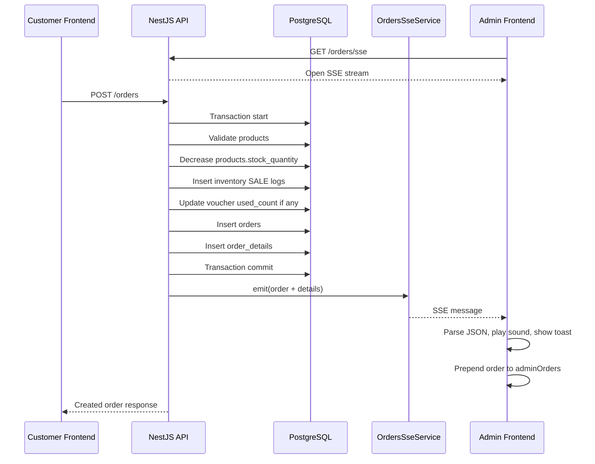

# Research: Database Schema va Realtime Don Hang

Tai lieu nay tom tat cau truc co so du lieu va co che realtime don hang cua he thong hien tai.

## 1. Tong quan cong nghe

- Backend: NestJS
- ORM: TypeORM
- Database: PostgreSQL
- Frontend: React + Vite
- HTTP client: Axios
- Realtime: Server-Sent Events (SSE) thong qua `EventSource` tren browser va `@Sse()` tren NestJS

TypeORM entities duoc khai bao trong:

- `apps/backend/src/entities/*.entity.ts`
- Dang ky vao TypeORM tai `apps/backend/src/app.module.ts`
- `synchronize: true` dang bat, nen TypeORM tu dong dong bo schema theo entity khi backend start.

## 2. So do co so du lieu

```mermaid
erDiagram
  USERS {
    int id PK
    string username UK
    string password_hash
    enum role "ADMIN | STAFF"
  }

  PRODUCTS {
    int id PK
    string name
    numeric price
    int stock_quantity
    enum type "RAW_MATERIAL | READY_TO_EAT"
    string category
    text image_url
    int version
  }

  VOUCHERS {
    int id PK
    string code UK
    numeric discount_amount
    numeric min_order_value
    int usage_limit
    int used_count
    int version
  }

  ORDERS {
    int id PK
    string customer_name "name | phone | address"
    numeric total_price
    numeric discount_applied
    numeric final_price
    enum status
    int voucher_id FK nullable
    datetime created_at
  }

  ORDER_DETAILS {
    int id PK
    int order_id FK
    int product_id FK
    int quantity
    numeric price_at_purchase
  }

  INVENTORY_TRANSACTIONS {
    int id PK
    int product_id FK
    enum transaction_type "IMPORT | SALE | ADJUSTMENT"
    int quantity_change
    datetime created_at
    int created_by FK
  }

  SUPPORTS {
    int id PK
    string customer_name
    string phone
    text message
    text reply
    string status "PENDING | REPLIED"
    datetime created_at
  }

  VOUCHERS ||--o{ ORDERS : "orders.voucher_id"
  ORDERS ||--o{ ORDER_DETAILS : "order_details.order_id"
  PRODUCTS ||--o{ ORDER_DETAILS : "order_details.product_id"
  PRODUCTS ||--o{ INVENTORY_TRANSACTIONS : "inventory_transactions.product_id"
  USERS ||--o{ INVENTORY_TRANSACTIONS : "inventory_transactions.created_by"
```

## 3. Chi tiet bang va quan he

### `products`

File: `apps/backend/src/entities/product.entity.ts`

Bang luu thong tin san pham:

- `id`: khoa chinh.
- `name`: ten san pham.
- `price`: gia ban.
- `stock_quantity`: so luong ton kho.
- `type`: loai san pham, gom `RAW_MATERIAL` va `READY_TO_EAT`.
- `category`: danh muc hien thi.
- `image_url`: link anh san pham.
- `version`: cot optimistic locking/canh tranh cap nhat, duoc TypeORM quan ly bang `@VersionColumn`.

Quan he:

- Mot san pham co the xuat hien trong nhieu dong `order_details`.
- Mot san pham co the co nhieu dong `inventory_transactions`.

### `orders`

File: `apps/backend/src/entities/order.entity.ts`

Bang luu don hang tong:

- `id`: ma don hang.
- `customer_name`: hien dang dong goi ca ten, so dien thoai va dia chi theo dang `name | phone | address`.
- `total_price`: tong tien truoc giam gia.
- `discount_applied`: so tien duoc giam.
- `final_price`: tong tien sau giam gia.
- `status`: trang thai don.
- `voucher_id`: khoa ngoai toi `vouchers`, nullable.
- `created_at`: thoi gian tao don.

Trang thai don hang nam trong enum `OrderStatus`:

- `PENDING`
- `PAID`
- `PREPARING`
- `SHIPPING`
- `COMPLETED`
- `CANCELLED`

Quan he:

- Mot don hang co the dung 0 hoac 1 voucher.
- Mot don hang co nhieu dong chi tiet trong `order_details`.

### `order_details`

File: `apps/backend/src/entities/order-detail.entity.ts`

Bang trung gian giua don hang va san pham:

- `id`: khoa chinh.
- `order_id`: khoa ngoai toi `orders`.
- `product_id`: khoa ngoai toi `products`.
- `quantity`: so luong san pham trong don.
- `price_at_purchase`: gia tai thoi diem mua, giup lich su don khong bi doi khi gia san pham thay doi sau nay.

Quan he:

- Nhieu `order_details` thuoc ve mot `order`.
- Nhieu `order_details` co the tro toi mot `product`.

### `vouchers`

File: `apps/backend/src/entities/voucher.entity.ts`

Bang ma giam gia:

- `id`: khoa chinh.
- `code`: ma voucher, unique.
- `discount_amount`: so tien giam.
- `min_order_value`: gia tri don toi thieu.
- `usage_limit`: so luot dung toi da.
- `used_count`: so luot da dung.
- `version`: dung de tranh race condition khi nhieu don cung dung voucher.

Quan he:

- Mot voucher co the duoc dung boi nhieu don hang.
- Mot don hang chi gan voi toi da mot voucher.

### `inventory_transactions`

File: `apps/backend/src/entities/inventory-transaction.entity.ts`

Bang nhat ky kho:

- `id`: khoa chinh.
- `product_id`: san pham lien quan.
- `transaction_type`: loai giao dich kho.
- `quantity_change`: bien dong so luong, am khi ban hang, duong khi nhap/hoan kho.
- `created_at`: thoi gian ghi nhan.
- `created_by`: user tao giao dich, thuong co khi admin/staff nhap kho.

Loai giao dich kho:

- `IMPORT`: nhap hang.
- `SALE`: ban hang, phat sinh khi tao don.
- `ADJUSTMENT`: dieu chinh, hien dang dung khi huy don de hoan kho.

### `users`

File: `apps/backend/src/entities/user.entity.ts`

Bang tai khoan quan tri:

- `id`: khoa chinh.
- `username`: ten dang nhap, unique.
- `password_hash`: mat khau da hash.
- `role`: `ADMIN` hoac `STAFF`.

Quan he:

- User co the duoc gan vao `inventory_transactions.created_by`.

### `supports`

File: `apps/backend/src/entities/support.entity.ts`

Bang tin nhan tu van/ho tro:

- `id`: khoa chinh.
- `customer_name`: ten nguoi gui.
- `phone`: so dien thoai.
- `message`: noi dung cau hoi/gop y.
- `reply`: noi dung admin/staff phan hoi.
- `status`: `PENDING` hoac `REPLIED`.
- `created_at`: thoi gian tao.

Bang nay doc lap voi don hang.

## 4. Luong tao don hang

### 4.1 Frontend gui don

File chinh: `apps/frontend/src/main.tsx`

Ham `handleCheckoutSubmit` tao payload:

```ts
const itemsDto = cart.map(x => ({
  product_id: x.product.id,
  quantity: x.quantity
}));

const packedCustomerName = `${shippingInfo.name.trim()} | ${shippingInfo.phone.trim()} | ${shippingInfo.address.trim()}`;

const payload = {
  customer_name: packedCustomerName,
  voucher_code: appliedVoucher?.code || undefined,
  items: itemsDto
};
```

Sau do gui request:

```ts
const res = await api.post('/orders', payload);
```

Neu thanh cong, frontend:

- Luu ma don va tong tien vao `createdOrderInfo`.
- Xoa gio hang.
- Reset voucher.
- Chuyen UI sang man hinh thanh cong.
- Goi `fetchProducts()` de cap nhat ton kho tren store.

### 4.2 Backend nhan don

File: `apps/backend/src/orders/orders.controller.ts`

Endpoint:

```ts
@Post()
create(@Body() dto: CreateOrderDto, @Req() req: any) {
  const userId = req?.user?.sub;
  return this.service.createOrder(dto, userId);
}
```

`CreateOrderDto` validate:

- `customer_name`: string.
- `voucher_code`: optional string.
- `items`: array.
- Moi item co `product_id` va `quantity`, deu la integer va >= 1.

### 4.3 Backend xu ly transaction

File: `apps/backend/src/orders/orders.service.ts`

Ham `createOrder` chay trong database transaction:

```ts
return this.ds.transaction(async (m) => {
  ...
});
```

Ben trong transaction:

1. Lay danh sach san pham theo `product_id`.
2. Kiem tra san pham co ton tai khong.
3. Tru ton kho bang update co dieu kien:

```ts
.where('id = :id AND version = :v AND stock_quantity >= :qty', {
  id: p.id,
  v: p.version,
  qty: item.quantity
})
```

Dieu kien nay giup tranh viec hai nguoi mua cung luc lam am kho.

4. Ghi `inventory_transactions` loai `SALE`.
5. Neu co voucher:
   - Tim voucher theo `code`.
   - Kiem tra don dat gia tri toi thieu.
   - Tang `used_count` voi dieu kien `version` va `used_count < usage_limit`.
6. Tao dong `orders`.
7. Tao cac dong `order_details`.
8. Tao payload realtime va emit SSE.

## 5. Co che realtime don hang

He thong dung Server-Sent Events (SSE).

SSE la co che realtime mot chieu:

- Browser mo mot ket noi HTTP dai toi server.
- Server day event ve browser khi co du lieu moi.
- Browser khong can polling lien tuc.
- Phu hop voi tinh huong admin can nhan thong bao don hang moi.

He thong khong dung WebSocket o luong nay.

### 5.1 Backend SSE service

File: `apps/backend/src/orders/orders-sse.service.ts`

Service nay dung `Subject` cua RxJS lam event bus in-memory:

```ts
private subject = new Subject<any>();

get event$() {
  return this.subject.asObservable();
}

emit(order: any) {
  this.subject.next(order);
}
```

Y nghia:

- `subject.next(order)` day mot don hang moi vao stream.
- Nhung client dang subscribe `event$` se nhan duoc event.
- Event bus nay chi nam trong RAM cua process backend.

### 5.2 Backend expose endpoint SSE

File: `apps/backend/src/orders/orders.controller.ts`

Endpoint:

```ts
@Sse('sse')
sse(): Observable<MessageEvent> {
  return this.sseService.event$.pipe(
    map(data => ({ data } as MessageEvent))
  );
}
```

Route day du:

```txt
GET /orders/sse
```

NestJS se giu ket noi HTTP mo va tra response theo dinh dang `text/event-stream`.

### 5.3 Backend emit sau khi tao don

File: `apps/backend/src/orders/orders.service.ts`

Sau khi luu `orders` va `order_details`, service tao payload:

```ts
const ssePayload = {
  ...order,
  details: createdDetails,
};
```

Sau do day event:

```ts
this.sse.emit(ssePayload);
```

Nghia la khi tao don thanh cong, moi client dang mo `GET /orders/sse` se nhan duoc order moi.

### 5.4 Frontend lang nghe SSE

File: `apps/frontend/src/main.tsx`

Khi app mount, frontend mo ket noi:

```ts
const sseSource = new EventSource(`${API_URL}/orders/sse`);
```

Khi server day event:

```ts
sseSource.onmessage = (event) => {
  const newOrder = JSON.parse(event.data) as Order;
  ...
};
```

Frontend sau do:

1. Goi `playChimeSound()` de phat am thanh bao don moi.
2. Set `newOrderAlert = true`.
3. Tang `alertCount`.
4. Them toast thong bao.
5. Chen don moi vao dau danh sach admin:

```ts
setAdminOrders(prev => [newOrder, ...prev]);
```

6. Neu admin dang dang nhap, goi lai dashboard stats:

```ts
if (adminToken) {
  fetchDashboardStats();
}
```

Khi component/app unmount, ket noi duoc dong:

```ts
return () => {
  sseSource.close();
};
```

### 5.5 Luong realtime end-to-end



## 6. Doi trang thai don hang

Trang thai don hang duoc doi qua REST, khong qua SSE.

Frontend admin goi:

```txt
PUT /orders/:id/status
```

Backend xu ly tai `OrdersService.updateStatus`.

Neu chuyen sang `CANCELLED` va don truoc do chua bi huy:

- Lay cac `order_details`.
- Cong lai `products.stock_quantity`.
- Ghi `inventory_transactions` loai `ADJUSTMENT`.
- Neu don co voucher, giam `used_count` cua voucher.

Sau khi update thanh cong, frontend cap nhat state local:

```ts
setAdminOrders(prev =>
  prev.map(o => o.id === orderId ? { ...o, status: nextStatus as any } : o)
);
```

Luu y: viec doi trang thai hien chua broadcast realtime sang cac admin khac.

## 7. Diem manh va gioi han hien tai

### Diem manh

- Tao don nam trong transaction nen tranh du lieu nua voi.
- Ton kho duoc tru bang dieu kien `stock_quantity >= qty`.
- `version` giup tranh conflict khi nhieu request cung cap nhat mot san pham/voucher.
- SSE don gian, nhe, phu hop thong bao don moi.
- Frontend khong can polling lien tuc.

### Gioi han

- `OrdersSseService` dung in-memory `Subject`, nen event mat khi backend restart.
- Neu deploy nhieu instance backend, moi instance co stream rieng, event khong tu dong chia se.
- `GET /orders/sse` hien dang public, client nao mo app cung co the nhan event don moi.
- Realtime moi chi ap dung cho don moi, chua ap dung cho doi trang thai don.
- `customer_name` dang chua duoc chuan hoa, vi gom ten, so dien thoai va dia chi trong mot chuoi.

### Huong cai tien neu muon nang cap

- Tach thong tin giao hang thanh cac cot rieng: `customer_name`, `phone`, `address`.
- Bao ve `GET /orders/sse` bang JWT neu chi admin/staff duoc nhan don moi.
- Broadcast ca su kien doi trang thai don qua SSE.
- Dung Redis Pub/Sub hoac message broker neu scale nhieu backend instance.
- Them bang `customers` neu can quan ly khach hang lau dai.
